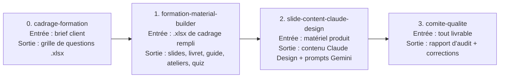
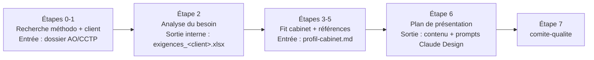

# Vue d'ensemble en 5 minutes

Une seule page pour montrer le pipeline à un nouvel arrivant en début de démo, **avant** qu'il n'installe quoi que ce soit. Synthèse du [README.md](README.md) — en cas de divergence, le `README.md` fait foi.

Ce dépôt couvre **deux pipelines** de skills Claude Code, indépendants l'un de l'autre.

## Pipeline formation

| # | Skill | Point de validation humaine |
|---|---|---|
| 0 | `cadrage-formation` | Le client répond à la grille de questions avant la suite |
| 1 | `formation-material-builder` | Cas fil rouge et roadmap validés avant compilation des documents finaux |
| 2 | `slide-content-claude-design` | Audit UX/UI recommandé avant la génération visuelle dans Claude Design |
| 3 | `comite-qualite` | Pause avant application des corrections si au moins un constat 🔴 bloquant |

Une cinquième skill optionnelle, `formation-pipeline`, enchaîne les 4 ci-dessus sans avoir à les relancer une par une — les points de validation restent les mêmes.

**Composition visuelle finale** : toujours manuelle dans Claude Design (aucune API programmatique à ce jour).

## Pipeline réponse à appel d'offres

Skill unique, `reponse-appel-offres`, en 8 étapes internes :

**Point de validation** : le profil cabinet (`profil-cabinet.md`) est renseigné interactivement s'il n'existe pas encore — jamais un cabinet présupposé. Un format de réponse imposé par le client, s'il est détecté, prime toujours sur le vocabulaire de blocs par défaut de l'Étape 6.

## Skills transverses (à la demande, pas une étape obligatoire)

| Skill | Alimente | Ce qu'elle fait |
|---|---|---|
| `design-system-extractor` | `slide-content-claude-design` | Extrait une charte graphique client de n'importe quel document fourni |
| `consultants-references-extractor` | `reponse-appel-offres` (Étapes 4bis/5bis) | Extrait un référentiel de CV et de références/missions, réutilisable d'un AO à l'autre. Confidentialité classée mais **jamais** auto-autorisée : confirmation humaine toujours requise avant usage externe |

## Modèle recommandé

**Sonnet 5**, niveau d'effort **`high`** pour l'ensemble des skills des deux pipelines (détail et justification complète dans [README.md § « Modèle et niveau d'effort recommandés »](README.md#modèle-et-niveau-deffort-recommandés)).

## Pour aller plus loin

- Installer les skills → [wiki/01-Installation](wiki/01-Installation/00-Sommaire.md)
- Utiliser le pipeline au quotidien → [wiki/02-Utiliser-le-pipeline.md](wiki/02-Utiliser-le-pipeline.md)
- Le format exact des fichiers échangés entre skills → [PIPELINE_CONTRACTS.md](PIPELINE_CONTRACTS.md)
- Contribuer → [CONTRIBUTING.md](CONTRIBUTING.md)
